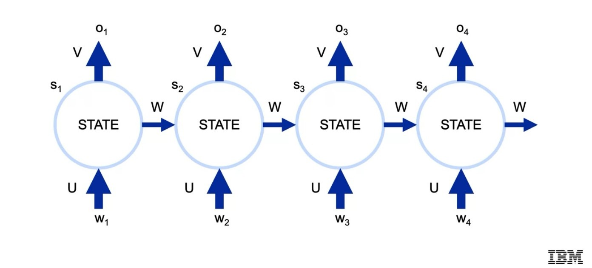

# Recurrent neural networks (RNNs)



Recurrent neural networks (RNNs) are a type of deep learning model that excels at handling [sequential data](https://mostly.ai/synthetic-data-dictionary/sequential-data#:~:text=Sequential%20data%20is%20data%20arranged,of%20numbers%20with%20a%20pattern.).

Unlike traditional neural networks where inputs are independent, RNNs have internal memory that allows them to process information from previous inputs and use it to influence the output for current inputs. This makes them particularly useful for tasks that involve sequences, like:

* Language translation
* Speech recognition
* Time series forecasting


## Run Locally

Clone the project (using command line)

```bash
  git clone https://github.com/ismailouahbi/RNNs.git
```

Go to the project directory

```bash
  cd RNNs
```

Setting up the Environment

A `virtual environment` is a Python environment such that the Python interpreter, libraries and scripts installed into it are isolated from those installed in other virtual environments.

* [source](https://www.freecodecamp.org/news/how-to-setup-virtual-environments-in-python/)

```bash
# create a virtual env named rnn_env
  python -m venv rnn_env
```

```bash
# activate the virtual env (windows)
  rnn_env\Scripts\activate
```

```bash
# install jupyter notebook
pip install notebook
```

```bash
# launch a jupyter notebook session
jupyter notebook
```

Go to `A_character-level_autocompletion_model_with_a_simple_RNN.ipynb`

Enjoy!

## Authors

- [Ismail Ouahbi](https://www.linkedin.com/in/ismail-ouahbi/)
